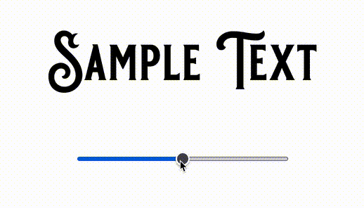

# Welcome to Kittl's frontend rendering assignment!

# Part 1

For part 1, you'll be working on a simplified rendering engine on HTML canvas (2D) to achieve a better performance.

[/src/rendering/engine](./src/rendering/engine) implements some basic functionalities to draw a bunch of circles and illustrations on the canvas. In [the demo](./src/rendering/index.tsx) we set up for you (run `yarn start` to see), a set of rendering steps can be triggered while the duration of rendering is measured and logged. You might notice that currently, it takes hundreds of milliseconds for each render. Imagine if those renderings happen one after another, we end up with a very low fps, thus bad experience.

What we expect from you is to implement changes against the engine to achieve a faster rendering, i.e., less time spent on each step and/or in total. Feel free to do analysis, experiments, just remember to document them well :) The result matters, but it's also crucial for us to see your thought process, how you detect problems, and find solutions.

Feel free to change anything inside [/src/rendering/engine/*](./src/rendering/engine), but please do not modify the rendering steps and the content drawn on the canvas.

## Useful links

[Canvas Api](https://developer.mozilla.org/en-US/docs/Web/API/Canvas_API)

# Part 2

Implement an Arch Transformation for the [provided svg file](.resources/sampleText.svg).

Create a simple UI with the rendered `svg` image and a slider beneath to control the strength of the Arch effect (like on the image above).

You can create it as a react component with a story that demonstrates how it works.  

## Useful links

### [paper.js](http://paperjs.org)

### [warpjs](https://github.com/benjamminf/warpjs)

Check [this example](https://codepen.io/benjamminf/pen/NpZLeb) for warpjs.

# General Requirements

- The assignment should be completed in TypeScript using React.
- Please work on a separate branch and [submit a Pull Request](https://docs.github.com/en/pull-requests/collaborating-with-pull-requests/proposing-changes-to-your-work-with-pull-requests/creating-a-pull-request) for review.

## Available Scripts

This project was bootstrapped with [Create React App](https://github.com/facebook/create-react-app).
In the project directory, you can run:

### `yarn start`

Runs the app in the development mode.
Open [http://localhost:3000](http://localhost:3000) to view it in the browser.

The page will reload if you make edits.
