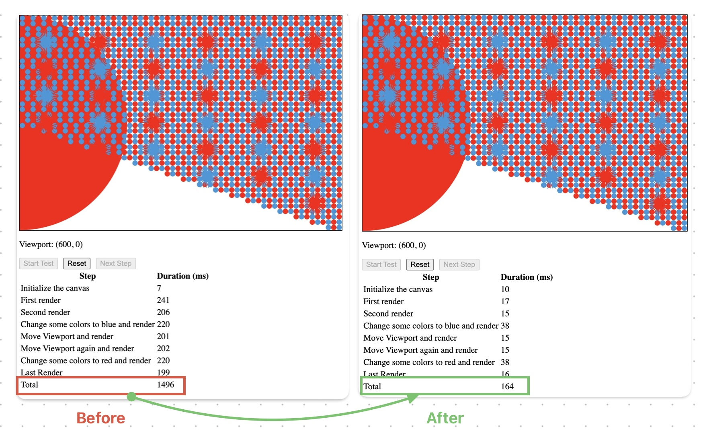
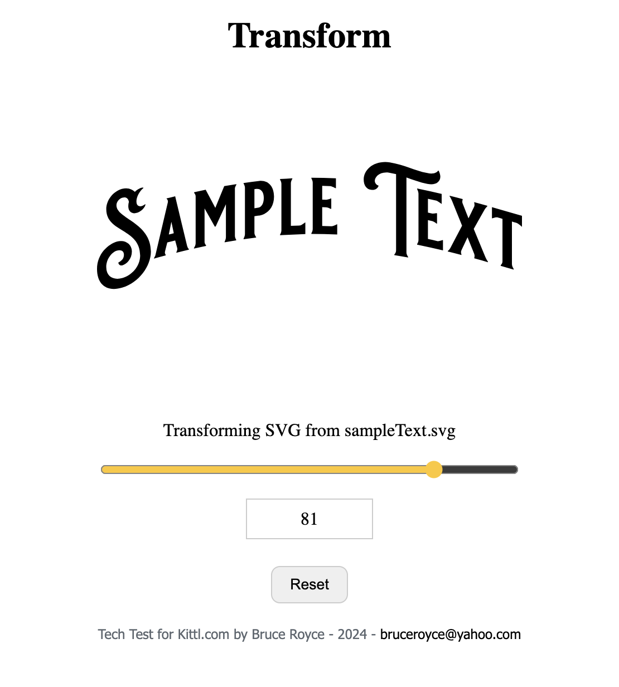

# Welcome to Kittl's frontend rendering assignment!

# Part 1

## Challenge

Part 1, was improving performance of a simplified rendering engine on HTML canvas (2D).

The original engine and setup was producing the image in total of about 1700ms (bad experience). The changes brough the total duration to about 160~170ms (acceptable performance), that's almost over 10 times faster.

## Solution



### Ovservation

I was only allowed to make changes within the `engine` directory.

```
└── 📁rendering
        └── 📁engine
            └── Canvas.ts
            └── 📁objects
                └── Circle.ts
                └── Illustration.ts
                └── Object.ts
```

#### Problem

In `Canvas.ts` I noticed the canvas context was being unneccessarily regenerated and error checked for every render that worked against performance.

#### Remedy

I changed this to be generated once when the class is being instantiated as a static field that could be accessed for a whole sesseion.

I kept the null checking only to stop the TypeScript from nagging about null possibility, although I could have forced not null (`!`) but I thought your TypeScript setting might not setup to appreciate not-null and error during compilation.

The extra checks however can be safely removed.

A few other minor changes has applied (eg. importing types correctly, etc.) - Please see the PR

**In short** the unneccessary canvas context creation is fixed

#### Further Improvement

I noticed one of the longer renders are when the colour changes. This is linked to the logic of filtering the objects to get the target object.
Currently, the logic loops through the whole set of objects.

This is because the `getInitialObjects()` returns an array.

```typescript
getInitialObjects() : ObjectData[]
```

If the objects initilliser was indexed, looping through the objects to find the object_id was eliminated.

For better understanding, please see bellow:

**❌ Current**

```typescript
// Bruce: Current update color method that should loop through objects everytime
 updateColor(objectId: number, color: string): void {
    const object = this.objects.find((object) => object.id === objectId);
    if (!object) {
      throw new Error(`Could not find object with id ${objectId}`);
    }
    object.setColor(color);
  }
```

**✅ Performant (indexed)**

```typescript
// Bruce: possiblly imporoved update color method that eliminates looping
type IndexedObject = Map<number, Object>;
const initializeObjects = (objects: ObjectData[], canvas: Canvas): IndexedObject => {
  const indexed : IndexedObject = new Map();
  objects.forEach((object) => {
    if (object.type === ObjectType.Circle) {
      indexed.set(object.id,new Circle(object, canvas));
    }
    if (object.type === ObjectType.Illustration) {
      indexed.set(object.id,new Illustration(object, canvas));
    }
    throw new Error(`Unknown object type ${object.type}`);
  });
  return indexed;
};

 updateColor(objectId: number, color: string): void {
    // using js Map
    // objects: Map<number, Object>;
    const object = objects.get(objectID);
    // or using js Objects
    // objects: {[k:number]: Object}[];
    // const object = objects[objectId]
    if (!object) {
      throw new Error(`Could not find object with id ${objectId}`);
    }
    object.setColor(color);
  }

  getObjects() : Object[] {
    // return map to array for compatibility
  }
```

I expect the above change to increase performance significantly, but the object initialiser is in `initialObjects.ts` that falls beyond the scope of this test.

### The major issue

But the major issues lied in the object initilisers, where the least amount of initilisation and preperation for optimal rendering were in place.

#### Problem

Many time-consuming computations were set to happen within th render method of each object, and most importntly, they were set to happen repeatedly for each traverse and points.

For example I noticed the render methos of the `Illustration.ts` as to be like: (notice the red flags in the comments)

```javascript
async render(ctx: CanvasRenderingContext2D): Promise<void> {
    // 🚩 Bruce: this check could have happened earlier in life cycle
    const path = await this.loadIllustration();
    if (!path.startsWith("M") || !path.endsWith("Z")) {
      throw new Error("Invalid path");
    }
    const commands = path.replace("M", "").replace("Z", "").split("L");

    // log the command of the illustration


    // draw the path
    ctx.save();
    ctx.fillStyle = this.color;
    ctx.beginPath();

  // 🚩 Bruce:segregated logic hard to maintain and understand
    const firstCommand = commands.shift();
    // 🚩 Bruce: this check could have happened earlier in life cycle
    if (!firstCommand) {
      throw new Error("Invalid path");
      // 🚩 Bruce: doesn't restore the canvas
    }
    const [x, y] = firstCommand.split(",");
    ctx.moveTo(
      -this.canvas.viewport.left + this.left + parseInt(x),
      -this.canvas.viewport.top + this.top + parseInt(y)
    );

    for (const command of commands) {
    // 🚩 Bruce: looped computation to extract absolute points
      const [x, y] = command.split(",");
      ctx.lineTo(
        // 🚩 Bruce: looped computation to calculate relative points
        -this.canvas.viewport.left + this.left + parseInt(x),
        -this.canvas.viewport.top + this.top + parseInt(y)
      );
    }

    ctx.closePath();
    ctx.fill();
    ctx.restore();
  }
```

#### Remedy

Many of these calculations, such as extracting the commands and points are moved to earlier in the object life cycle, prepared for the renderer.

The absolute to relative poisition calculation needed to be fresh at the render time to accommodate camera move.

**In short** two main improvement have been applied:

- The shapes class `constructor`s are updated to handle as many preperation (pre-calculation) as possible for the `render` method to take leverage when it is called.

- the render methods are updated to follow a simpler and more straight-forward logics, and most importntly to take advantage of prepared data during the instantioation.

#### Further imporvement

The setup can further improved if we set a flag to notify the renderer when `viewport` is set. With that the _absolute-to-relative_ calculations can be skipped where not neccessary (eg. when the colour is changed but not the position)

# Part 2

## Challenge

Implement an Arch Transformation for the [provided svg file](.resources/sampleText.svg).


## Solution



I create a simple UI as per the instruction.

You can create it as a react component with a story that demonstrates how it works. <br />

## Useful links

### [paper.js](http://paperjs.org)

### [warpjs](https://github.com/benjamminf/warpjs)

# General Requirements

- The assignment should be completed in TypeScript using React.
- Please work on a separate branch and [submit a Pull Request](https://docs.github.com/en/pull-requests/collaborating-with-pull-requests/proposing-changes-to-your-work-with-pull-requests/creating-a-pull-request) for review.

## Available Scripts

This project was bootstrapped with [Create React App](https://github.com/facebook/create-react-app).
In the project directory, you can run:

### `yarn start`

Runs the app in the development mode.
Open [http://localhost:3000](http://localhost:3000) to view it in the browser.

The page will reload if you make edits.
