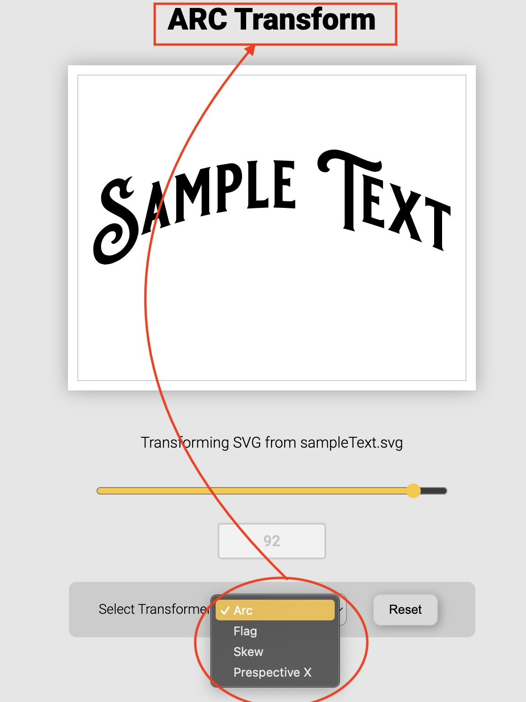

# Welcome to Kittl's frontend rendering assignment!

# Part 1

## Challenge

Part 1, was improving performance of a simplified rendering engine on HTML canvas (2D).

The original engine and setup was producing the image in total of about 1500-1700ms (bad experience). The changes brough the total duration to about 92~115ms (acceptable performance), that's almost over 10 times faster.

## Solution


### Ovservation

I was only allowed to make (constructual) changes within the `engine` directory.

```
└── 📁rendering
        └── 📁engine
            └── Canvas.ts
            └── 📁objects
                └── Circle.ts
                └── Illustration.ts
                └── Object.ts
```

#### Problem 1

In `Canvas.ts` I noticed the canvas context was being unneccessarily regenerated and error checked for every render that worked against performance.

#### Remedy for problem 1

I changed this to be generated once when the class is being instantiated as a static field that could be accessed for a whole sesseion via static `Canvas.ctx`.

The extra null checks safely removed.

A few other minor changes has applied (eg. importing types correctly, etc.) - Please see the PR

**In short** the unneccessary canvas context creation is fixed

#### Problem 2

I noticed one of the longer renders are when the colour changes. This is linked to the logic of filtering the objects to get the target object.
Currently, the logic loops through the whole set of objects.

This is because the `getInitialObjects()` returns an array.

```typescript
getInitialObjects() : ObjectData[]
```

#### Remedy to problem 2

I updated the objects initilliser to be indexed by the `object.id`, looping through the entire objects each time to find the object_id was eliminated.

For better understanding, please see bellow:

**❌ Current**

```typescript
// Bruce: Current update color method that should loop through objects everytime
 updateColor(objectId: number, color: string): void {
    const object = this.objects.find((object) => object.id === objectId);
    if (!object) {
      throw new Error(`Could not find object with id ${objectId}`);
    }
    object.setColor(color);
  }
```

**✅ Performant (indexed)**

```typescript
// Bruce: imporoved update color method that eliminates looping
  updateColor(objectId: number, color: string): void {
    this.objects[objectId]?.setColor(color);
  }
```

#### Other improvements:

- All objects with `width` or `height` of `0`, are filteredd out because they won't draw anything but add to the load. (See `engine/utils/objectSanity/isObjectsane.ts`)

- the canvas resolution is fixed to be only as large as necessary.

- unnecessary steps in clearing the canvas was removed

### The major issue

But the major issues lied in the object initilisers, where the least amount of initilisation and preperation for optimal rendering were in place.

#### Problem 1

Many time-consuming computations were set to happen within th render method of each object, and most importntly, they were set to happen repeatedly for each traverse and points.

For example I noticed the render methos of the `Illustration.ts` as to be like: (notice the red flags in the comments)

```javascript
async render(ctx: CanvasRenderingContext2D): Promise<void> {
    // 🚩 Bruce: this check could have happened earlier in life cycle
    const path = await this.loadIllustration();
    if (!path.startsWith("M") || !path.endsWith("Z")) {
      throw new Error("Invalid path");
    }
    const commands = path.replace("M", "").replace("Z", "").split("L");

    // draw the path
    ctx.save();
    ctx.fillStyle = this.color;
    ctx.beginPath();

  // 🚩 Bruce:segregated logic hard to maintain and understand
    const firstCommand = commands.shift();
    // 🚩 Bruce: this check could have happened earlier in life cycle
    if (!firstCommand) {
      throw new Error("Invalid path");
      // 🚩 Bruce: doesn't restore the canvas
    }
    const [x, y] = firstCommand.split(",");
    ctx.moveTo(
      -this.canvas.viewport.left + this.left + parseInt(x),
      -this.canvas.viewport.top + this.top + parseInt(y)
    );

    for (const command of commands) {
    // 🚩 Bruce: looped computation to extract absolute points
      const [x, y] = command.split(",");
      ctx.lineTo(
        // 🚩 Bruce: looped computation to calculate relative points
        -this.canvas.viewport.left + this.left + parseInt(x),
        -this.canvas.viewport.top + this.top + parseInt(y)
      );
    }

    ctx.closePath();
    ctx.fill();
    ctx.restore();
  }
```

#### Remedy to problem 1

Many of these calculations, such as extracting the commands and points are moved to earlier in the object life cycle, prepared for the renderer.

The absolute to relative poisition calculation needed to be fresh at the render time to accommodate camera move.

**In short** two main improvement have been applied:

- The shapes class `constructor`s are updated to handle as many preperation (pre-calculation) as possible for the `render` method to take leverage when it is called.

- the render methods are updated to follow a simpler and more straight-forward logics, and most importntly to take advantage of prepared data during the instantioation.

#### Problem 2

I have added a check to skip rendering the shapes that are falling outside of the canvas visible area.
via `isInView`. (See `engine/utils/camera.ts` function `isInView`)

If not in view, a flag is being set and renderer safely skipps the rendering while still resolving the render promise.

#### Other imporvements applied

- The setup is improved to notify the renderer when `viewport` is changed. So the recalculation for the points positions ONLY happens when there is a camera movement, otherwise prepared data will be reused. (See `engine/utils/camera.ts` function `isCameraMoved`)

- Invalidity checks brought to be executed as early as possible to avoid waste. ((See `engine/utils/objectSanity/isObjectSane.ts` function `isObjectValid`))

# Part 2

## Challenge

Implement an Arch Transformation for the [provided svg file](.resources/sampleText.svg).

## Solution



I create a simple UI as per the instruction.

I also added a react component with a story that demonstrates how it works. <br />

<div className="howItWorks">
<h3>How It Works</h3>

<b>The trick</b> is to <b>reset the SVG</b> to its original state before applying each transformation, otherwise the transformation goes out of hand as they will be added on the top of eachother.

The main logic are in useWarp and `useTransformer` hooks, that use WarpJS to transform the
SVG

- On the first run, I grap the relaxed (reset) svg points. I calculate
  the correct size of the shape and set the dimensions and the
  viewport accordingly. Some gap (padding) is considered to house the
  transformed svg.

- The SVG is then transformed by the selected `transformer`
  with its amplitude set by the range input (see
  `useTransformer`):

  - <b>Arc Transformer (default)</b> is sine wave added to the y
    values. The sine wave is calculated by the formula
    `  <i>y = q * Math.sin((Math.PI / 2) * (x / midPoint))</i>`
    Here `q` is based on the given range and
    `midPoint` is half of the `width`
    of the SVG (offset by the smallest x).

🙋🏻‍♂️ <b>I added the following extra transformers for a bit of showin-off (I hope you don't mind!)</b>

- <b>Flag Transformer</b> (just to show-off!) is also sine wave
  added to the y values, with its `midPoint` set in
  quarter of the `width`!

- <b>Skew</b> (just to show-off!) uses a sloped line formula to
  changes the y values on a slope:
  `  <i>y = a * x + y</i>`

- <b>Perspective X</b> (just to show-off!) also follows the sloped line formula, with its baseline being the `midPoint`in the SVG height. In addition to that, there is another scale
  factor that boostes `y` value so to scale things up as they diverge from eachother. I fond the height midpoint and
  any y above that will slope-up and slope-down for the `y`'s less than midpoint.

### Resting SVG

The SVG is reset by the Reset button, which resets the SVG to its
original state.

# General

- The assignment was completed in TypeScript using React.

## Running the code

Please use `yarn start` and open [http://localhost:3000](http://localhost:3000) to view it in the browser to see the buttons that redirect you to **Part 1** and **Part 2** of the challege solutions

<hr />
Please let me know if there is any questions or anything is missing

Thank you very much<br />Bruce Royce<br/>(bruceroyce@yahoo.com)
